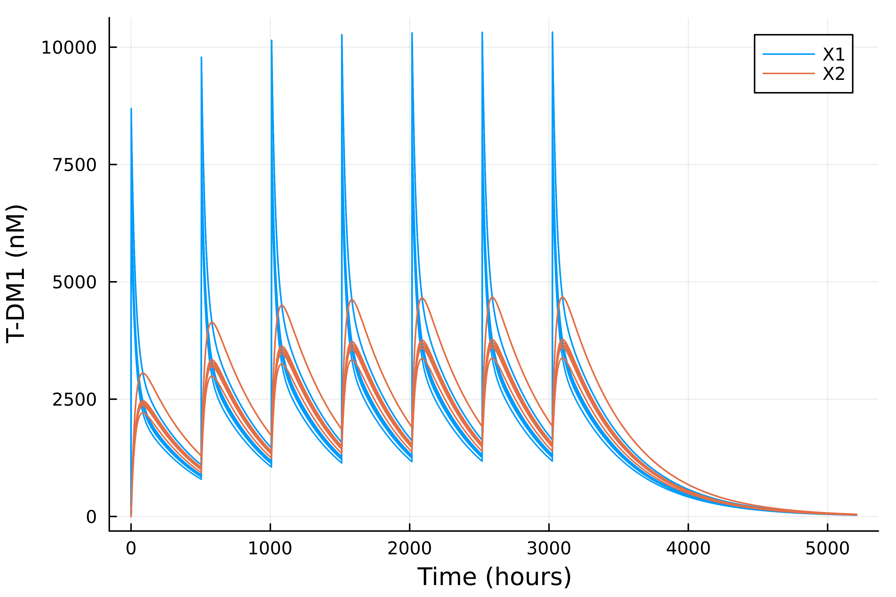

# PMSimulator

## Disclaimer: This is an initial release of packages presented in a workshop and poster at ACoP14. Still undergoing validation and qualification. 

This package enables simulation of complex input and model update events by creating simple vectors of event objects or by directly passing in a NONMEM-like dataset. 

Currently implemented:
* Bolus dosing
* Continuous infusions
  * specified with rate or time
* Parameter and state updates/resets
* addl
* ii

More to come:
* SS
* F
* etc.

### Quick Example Using Event Objects

##### Model (See [PMParameterized](https://github.com/metrumresearchgroup/PMParameterized.jl))
```julia
# define model
mdl = @model mod begin
    @IVs t [unit = u"hr", description = "time", tspan = (0.0, 100.0)]
    D = Differential(t)
    @constants day_to_h = 24.0, [unit=u"hr/d", 
                                 description = "Convert days to hours"]
    @parameters begin 
        CL_ADC = 0.0043, [unit = u"L/d", 
                            description = "central clearance"]
        CLD_ADC = 0.014, [unit = u"L/d", 
                          description = "intercompartmental clearance"]
        V1_ADC = 0.034,       [unit = u"L", 
                               description = "central volume"]
        V2_ADC = 0.04,        [unit = u"L", 
                               description = "peripheral volume"]
    end
    CL_ADC = CL_ADC/day_to_h
    CLD_ADC = CLD_ADC/day_to_h
    @variables begin
        (X1_ADC(t) = 0.0), [unit = u"nmol", 
                                 description = "ADC amount in Compartment 1"]
        (X2_ADC(t) = 0.0), [unit = u"nmol", 
                                 description = "ADC amount in Compartment 2"]
    end
    @observed begin
        C_X1 = X1_ADC/V1_ADC
        C_X2 = X2_ADC/V2_ADC
    end
    @eq D(X1_ADC) ~ -(CL_ADC/V1_ADC)*X1_ADC - 
                        (CLD_ADC/V1_ADC)*X1_ADC + 
                        (CLD_ADC/V2_ADC)*X2_ADC
                        
    @eq D(X2_ADC) ~ (CLD_ADC/V1_ADC)*X1_ADC - 
                        (CLD_ADC/V2_ADC)*X2_ADC
end;

# define simulation conditions
MW = 148781.0                                   # [g/mol] T-DM1 molecular weight (Scheuher et al 2022)
BW = 70                                         # [kg] human body weight
dose_in_mgkg = 3.6                              # mg/kg per Girish 2012 data
dose = (dose_in_mgkg * 1e-3 * BW) / (MW / 1e9)  # nmol
mdl.states.X1_ADC = dose
mdl.tspan = (0.0, 24*21)
```

##### Dosing Events
```julia
ev1 = PMInput(time = 0.0, amt = mgkg_to_nmol(3.6, 70.0), input = :X1_ADC, ii = 504, addl = 6);
ev2 = PMInput(time = 7*24*21, amt = mgkg_to_nmol(2.4, 70.0), input = :X1_ADC, ii = 336, addl = 4);
evs = [ev1, ev2]

sol = solve(mdl,evs,AutoTsit5(Rosenbrock23()),saveat=1.0);

# plot
plot(sol.t, sol.C_X1, label = "X1", xlabel="Time (hours)", ylabel="T-DM1 (nM)", dpi=600)
plot!(sol.t, sol.C_X2, label = "X2")
````
<p align="center">

</p>


##### Input DataFrames
Example using a NONMEM-like dataframe with multiple individuals/IDs
```julia
#Use an example dataset
data = DataFrame(CSV.File("tdm1.csv"))
# Modify to set infusion compartment,  and modify 
data = @chain data begin
    @mutate(input = ifelse(CMT == 1, :X1_ADC, :nothing))
end;


sol = solve(mdl,data,AutoTsit5(Rosenbrock23()),saveat=1.0);

plt = plot(xlabel="Time (hours)", ylabel="T-DM1 (nM)", dpi=600)
[plot!(sol[i].t, sol[i].C_X1,color=get_color_palette(:auto,17)[1],label=i ==1 ? "X1" : nothing) for i in keys(sol)];
[plot!(sol[i].t, sol[i].C_X2,color=get_color_palette(:auto,17)[2],label=label=i==1 ? "X2" : nothing) for i in keys(sol)];
display(plt)
```

<p align="center">

</p>


  

